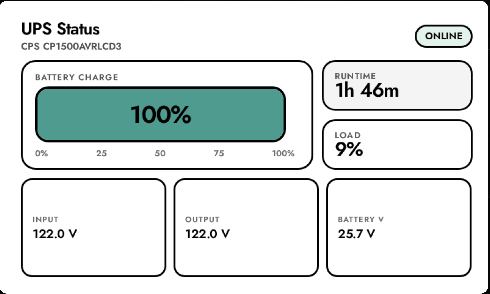
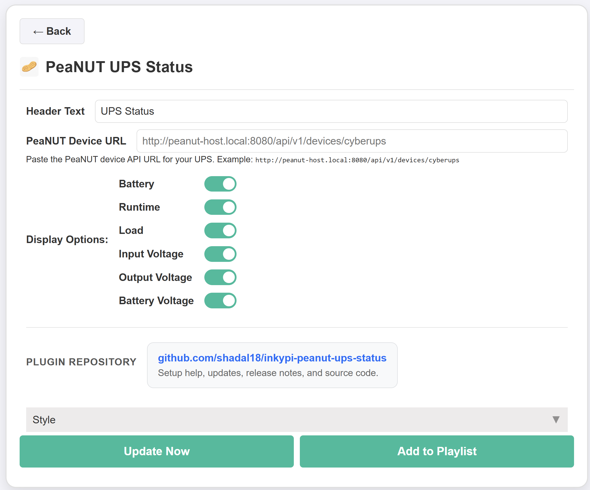

# InkyPi PeaNUT Uninterruptible Power Supply Status

An plugin that shows UPS status information from a PeaNUT device endpoint on an InkyPi display with a clean, glanceable layout and configurable display fields.

_PeaNUT UPS Status_ is a plugin for [InkyPi](https://github.com/fatihak/InkyPi) that displays power and battery information from your PeaNUT UPS setup.

## Install

Use the InkyPi plugin installer with the plugin ID and this repository URL, following the install pattern shown by the official InkyPi plugin template.

```bash
inkypi plugin install peanut_ups_status https://github.com/shadal18/inkypi-peanut-ups-status
```

## Update

To update the plugin on your InkyPi device:

1. SSH into your InkyPi host.
2. Change into the plugin directory:
   ```bash
   cd ~/InkyPi/src/plugins/peanut_ups_status
   ```
3. Run this update command:
   ```bash
   git pull origin main && \
   if [ -d peanut_ups_status ]; then \
     rsync -a peanut_ups_status/ ./ && \
     rm -rf peanut_ups_status; \
   fi && \
   sudo systemctl restart inkypi.service
   ```

If you don’t see your changes after updating:

- Confirm you are in the correct plugin folder.
- Clear your browser cache or hard refresh the InkyPi web UI.
- Check the InkyPi logs for any plugin errors.

If you don’t see your changes after updating:

- Confirm you are in the correct plugin folder.
- Clear your browser cache or hard refresh the InkyPi web UI.
- Check the InkyPi logs for any plugin errors.

## Requirements

- A reachable PeaNUT instance with its device API available over HTTP.
- Network access from the InkyPi device to the PeaNUT host.

## Features

This plugin is an extension for the InkyPi e-paper display frame and includes the following features.

- Shows current UPS status from a PeaNUT device endpoint.
- Displays battery percentage.
- Displays estimated runtime remaining.
- Displays UPS load percentage.
- Optional input voltage display.
- Optional output voltage display.
- Optional battery voltage display.
- Clean layout optimized for quick glance reading on e-paper.
- PeaNUT-only design, so no local NUT client tools are required on the InkyPi device.

## Settings

The plugin settings page lets you customize:

- PeaNUT device URL.
- Header text.
- Show or hide battery.
- Show or hide runtime.
- Show or hide load.
- Show or hide input voltage.
- Show or hide output voltage.
- Show or hide battery voltage.

## Repository

GitHub repository:

[https://github.com/shadal18/inkypi-peanut-ups-status](https://github.com/shadal18/inkypi-peanut-ups-status)

## Screenshots

- PeaNUT UPS status Plugin.
- Settings.

<p align="center">
  
  
</p>
